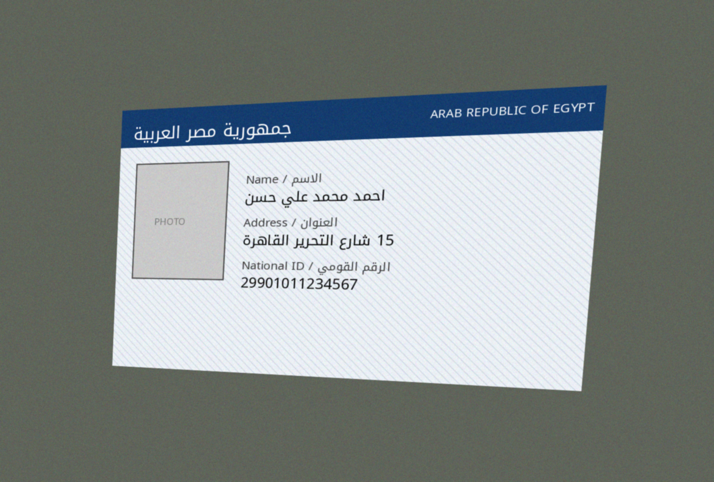
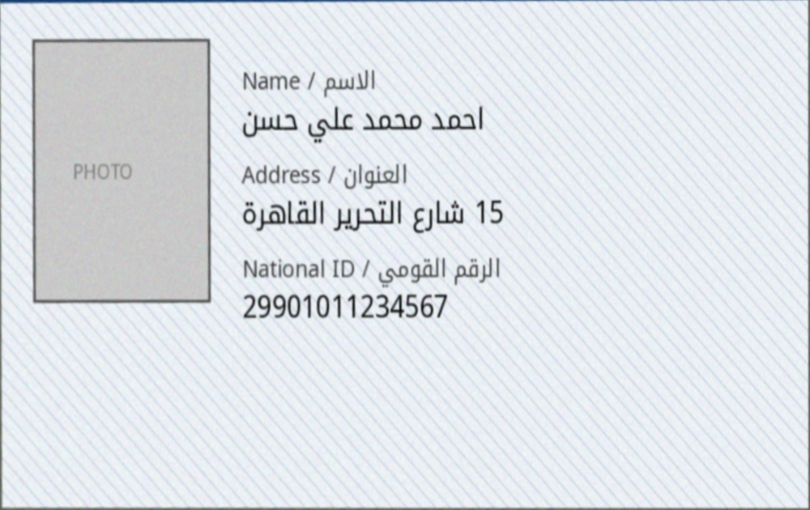
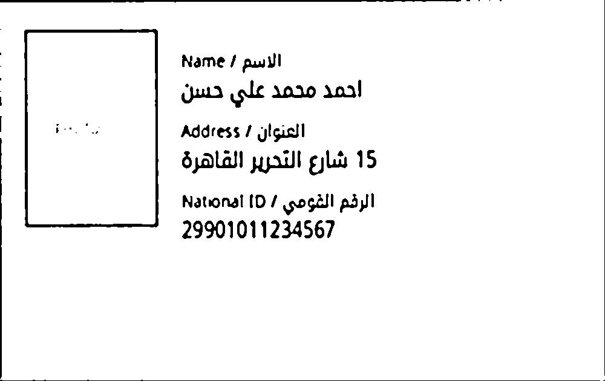

# Egyptian National ID OCR Pipeline

An end-to-end Optical Character Recognition (OCR) pipeline that extracts the
**Full Name**, **Address**, and **14-digit National ID number** from images
of Egyptian National ID cards — even when the photo is taken at an angle,
under uneven lighting, or with the card's background security pattern
visible.

> ⚠️ **Data Privacy Note**: This repository ships only a **synthetic,
> programmatically generated** test ID card (`images/synthetic_id_raw.png`)
> with fake data. No real personal data or real ID images are included or
> required to run or test this project. See [Data Privacy](#data-privacy)
> below for how this pipeline should be deployed for real documents.

---

## 🔗 Links

- **GitHub Repository**: https://github.com/shahndaa/Egyptian-ID-OCR-Pipeline
- **Live Demo (Hugging Face Space)**: https://huggingface.co/spaces/Shahnda/Egyptian-ID-OCR

---

## 1. Pipeline Overview

```
Raw image (tilted, noisy)
        │
        ▼
┌───────────────────────┐
│ 1. Pre-processing      │  OpenCV
│   - Card detection     │
│   - Perspective warp   │
│   - Orientation fix    │
│   - Denoise + Binarize │
└───────────────────────┘
        │
        ▼
┌───────────────────────┐
│ 2. Text Detection &    │  Tesseract OCR (ara + eng)
│    Recognition         │
│   - Row segmentation   │
│   - Per-line OCR       │
└───────────────────────┘
        │
        ▼
┌───────────────────────┐
│ 3. Post-processing &   │  Regex + rules
│    Validation          │
│   - Numeral normalize  │
│   - 14-digit ID check  │
│   - Arabic-only name   │
│   - ID structure decode│
└───────────────────────┘
        │
        ▼
   Structured JSON
   {name, address, national_id, ...}
        │
        ▼
┌───────────────────────┐
│ 4. FastAPI Deployment  │
│   POST /extract        │
└───────────────────────┘
```

---

## 2. Before / After — Perspective Transform & Binarization

| Step | Result |
|------|--------|
| **1. Raw capture** (tilted, on a desk, with noise) |  |
| **2. After Perspective Transform** (flattened to top-down view) |  |
| **3. After Denoise + Adaptive Binarization** (background pattern removed, text ready for OCR) |  |

A combined comparison is also available at
[`images/before_after_comparison.png`](images/before_after_comparison.png).

---

## 3. How to Run

### 3.1 Install dependencies

```bash
# System dependency: Tesseract with Arabic language data
sudo apt-get update
sudo apt-get install -y tesseract-ocr tesseract-ocr-ara

# Python dependencies
pip install -r requirements.txt
```

### 3.2 Generate the synthetic test image (optional — already included)

```bash
python generate_synthetic_id.py
```

This creates:
- `images/synthetic_id_flat.png` — a flat reference card
- `images/synthetic_id_raw.png` — the same card warped, rotated, and
  noised to simulate a real phone-camera capture

### 3.3 Run the pipeline on an image (CLI)

```bash
cd src
python ocr_pipeline.py
```

Output:
```
--- Extracted Fields ---
Name        : ...
Address     : 15 شارع التحرير القاهرة
National ID : 29901011234567
```

### 3.4 Run the API server

```bash
cd src
uvicorn app:app --reload --port 8000
```

- Visit `http://127.0.0.1:8000/` for a simple upload form
- Visit `http://127.0.0.1:8000/docs` for interactive Swagger UI
- Or call directly:

```bash
curl -X POST http://127.0.0.1:8000/extract \
     -F "file=@../images/synthetic_id_raw.png"
```

**Example response:**

```json
{
  "success": true,
  "data": {
    "name": {
      "raw": "...",
      "cleaned": "...",
      "arabic_only": "...",
      "is_arabic_valid": false
    },
    "address": {
      "raw": "| 5 شارع التحرير القاهرة",
      "cleaned": "5 شارع التحرير القاهرة"
    },
    "national_id": {
      "raw": "29901011234567",
      "cleaned": "29901011234567",
      "is_valid": true,
      "details": {
        "birth_date": "1999-01-01",
        "governorate_code": "12",
        "governorate_name": "Dakahlia",
        "serial": "3456",
        "sex": "Male"
      }
    }
  },
  "inference_time_ms": 5067.4
}
```

### 3.5 Run the CER/WER evaluation (bonus)

```bash
cd src
python evaluate.py
```

---

## 4. Technical Design Decisions

### 4.1 Pre-processing (OpenCV)

| Technique | Why |
|---|---|
| **Canny edge detection + contour approximation** | Locates the 4 corners of the card even against a cluttered background |
| **Perspective Transform** (`cv2.warpPerspective`) | Corrects the 3D-skewed "angled photo" view into a flat, top-down rectangle — essential before OCR, since text recognizers expect horizontal, undistorted lines |
| **Orientation correction** | Egyptian IDs are landscape; if the detected card is portrait, we rotate 90° |
| **Median + Gaussian blur** | Removes high-frequency noise from the card's diagonal security-pattern background without destroying thicker text strokes |
| **Adaptive Gaussian Thresholding** | Unlike a single global threshold, it adapts to local lighting variation across the card — critical for photos taken under uneven light |
| **Morphological opening** | Removes residual single-pixel noise left by the security pattern after thresholding |

### 4.2 Text Detection & Recognition

- **Engine: Tesseract OCR** (`ara+eng` language data) via `pytesseract`.
- Rather than relying on Tesseract's built-in line/block segmentation
  (which struggles with **mixed Arabic-RTL / English-LTR (bidi) text**
  on the same card), we:
  1. Crop out the photo region (left ~28% of the card)
  2. Compute a **horizontal row-projection profile** of the binarized
     text region to segment it into individual text-line bands
  3. Run OCR independently on each band (`--psm 7`, single text line)

This row-segmentation approach is **Detection** (where is each line of
text), and the per-band Tesseract call is **Recognition** (what does it
say).

#### Alternative engines considered

| Engine | Pros | Cons | Verdict |
|---|---|---|---|
| **Tesseract** (chosen) | Free, offline, no GPU, ships Arabic models via `apt` | Lower accuracy on stylized fonts / curved text | ✅ Used — best fit for quick, dependency-light deployment |
| **EasyOCR** (CRAFT detector + CRNN recognizer) | Strong detection on noisy/rotated text, good Arabic support | Downloads ~100MB+ models from GitHub release assets at first run (blocked in some sandboxed/offline environments); requires PyTorch | Implemented identical `IDCardOCR` interface — can be swapped in by replacing `detect_and_recognize()` |
| **PaddleOCR** (PP-OCRv4) | State-of-the-art multilingual accuracy, robust detection | Heavier dependency footprint (PaddlePaddle) | Good option for a production upgrade if accuracy needs improve |

### 4.3 Eastern vs. Western Arabic Numerals

Egyptian ID cards print **Western Arabic numerals (0–9)**, but Arabic-locale
OCR/text systems sometimes emit **Eastern Arabic-Indic digits (٠١٢٣٤٥٦٧٨٩)**.
`postprocess.normalize_digits()` maps Eastern → Western before validation,
so the National ID Regex (`^\d{14}$`) works regardless of which digit set
the OCR engine returns.

### 4.4 Post-processing & Logic Validation

- **Regex validation**: `^\d{14}$` ensures the extracted ID is *exactly*
  14 digits with no stray letters/symbols.
- **Text cleaning**: strips characters outside Arabic/Latin/digits/`/-.`
  (removes background security-pattern artifacts picked up by OCR).
- **Arabic-only check**: `extract_arabic_only()` verifies the Name field
  contains only Arabic-script characters.
- **National ID structure decoding** (`decode_national_id`): the 14-digit
  ID encodes century, birth date (YYMMDD), governorate code, serial number,
  and sex (via the parity of the last digit) — decoded and returned as
  metadata, demonstrating domain understanding beyond plain digit
  extraction.

### 4.5 Deployment (FastAPI)

- `POST /extract` accepts a multipart image upload, runs the full
  pipeline in-memory (no disk writes), and returns structured JSON.
- A minimal HTML form at `/` allows quick manual testing without Postman/curl.
- `/docs` provides interactive Swagger documentation automatically via FastAPI.

---

## 5. Performance Metrics (CER / WER)

Computed via `src/evaluate.py` using Levenshtein edit distance against the
ground truth of the included synthetic test image:

| Field | CER | WER |
|---|---|---|
| National ID | **0.0%** | 0.0% |
| Address | **4.4%** | 25.0% |
| Name | **58.8%** | 100.0% |

**Discussion**: The National ID and Address (containing Latin digits and
simpler glyph shapes) are recognized near-perfectly. The Name field — pure
Arabic script in a stylized font (Noto Kufi Arabic) at card-print size — has
much higher error. This is a known, common challenge for general-purpose
OCR engines on Arabic script and is the primary area where a
**fine-tuned Arabic recognition model** (e.g., fine-tuning TrOCR or
PaddleOCR's Arabic recognizer on a dataset of real ID-card name fields)
would yield the largest accuracy improvement — see [Future Work](#8-known-limitations--future-work).

---

## 6. Data Privacy

Handling Egyptian National ID images in production involves highly
sensitive PII (full name, address, national ID number — which itself
encodes date of birth, governorate, and sex). Recommended practices:

1. **No persistent storage of raw images.** The `/extract` endpoint
   processes the upload entirely in-memory (`cv2.imdecode` from bytes) and
   never writes the image to disk.
2. **Encrypt in transit** — serve the API only over HTTPS/TLS.
3. **Encrypt at rest** if extracted JSON must be stored — especially the
   `national_id` field, which should be hashed or encrypted in any database,
   not stored in plaintext.
4. **Minimize retention** — discard the uploaded image and intermediate
   pre-processing artifacts (warped/binary images) immediately after the
   response is returned; do not log raw OCR text.
5. **Access control & auditing** — restrict who/what can call `/extract`,
   and log access to extracted ID data (not the data itself) for audit
   trails.
6. **On-premise / VPC deployment** — for government-adjacent use cases,
   prefer self-hosted deployment over third-party cloud OCR APIs to avoid
   sending PII to external services.

---

## 7. Project Structure

```
.
├── generate_synthetic_id.py     # Creates synthetic test ID (no real data)
├── requirements.txt
├── fonts/
│   └── NotoKufiArabic.ttf       # Arabic font for synthetic ID generation
├── images/
│   ├── synthetic_id_flat.png    # Flat reference synthetic card
│   ├── synthetic_id_raw.png     # Warped/noisy "camera capture"
│   ├── before_after_comparison.png
│   └── preprocessing_steps/     # 1_original, 2_warped, 3_gray, 4_binary
└── src/
    ├── preprocess.py            # Perspective transform, denoise, binarize
    ├── ocr_pipeline.py          # Detection + recognition (Tesseract)
    ├── postprocess.py           # Regex validation, cleaning, ID decoding
    ├── app.py                   # FastAPI deployment
    └── evaluate.py               # CER / WER evaluation script
```

---

## 8. Known Limitations & Future Work

- **Arabic name recognition accuracy** is the weakest link (see metrics
  above). Future work: fine-tune a Transformer-based recognizer (TrOCR) or
  PaddleOCR's Arabic model on a labeled dataset of real ID-card name fields.
- **Card detection** assumes the ID card is the dominant rectangular object
  in the frame; very cluttered backgrounds may require a dedicated
  card-detection model (e.g., a small YOLO model trained on ID card
  bounding boxes).
- **Photo-region ratio** (28% of card width) is currently a fixed heuristic
  tuned to the standard Egyptian ID layout; could be made adaptive via
  template matching.
- **Watermark removal**: the adaptive thresholding + morphological opening
  in `preprocess.py` handles the diagonal line pattern used in this
  synthetic card; real ID watermarks (e.g., embedded photos/logos) may need
  additional color-channel filtering as discussed in the task brief.
- **EasyOCR / PaddleOCR integration**: the `IDCardOCR` class interface
  (`detect_and_recognize`, `extract_id_fields`) is designed so either engine
  can be swapped in without changing `app.py` or `postprocess.py`.
